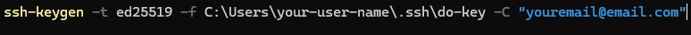
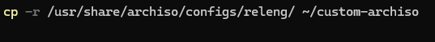
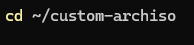
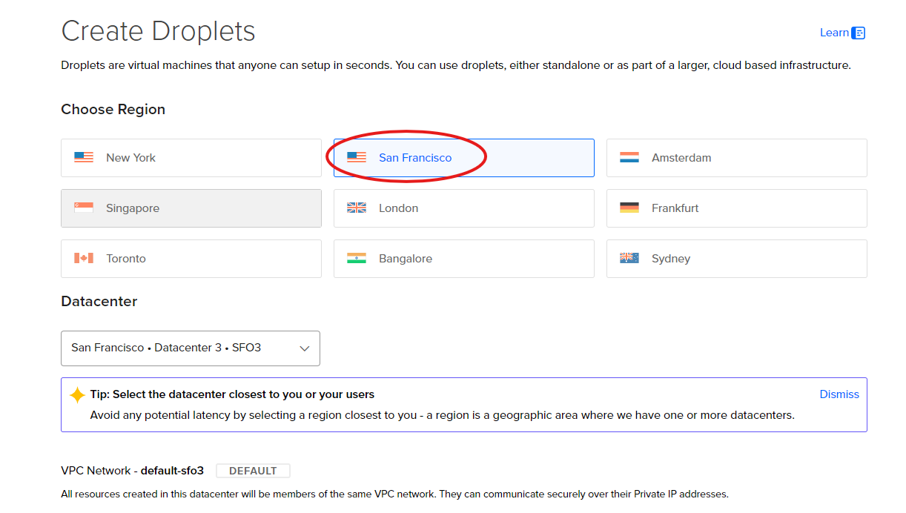
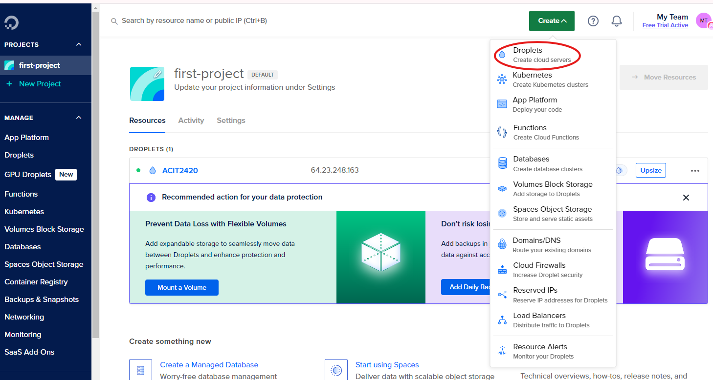
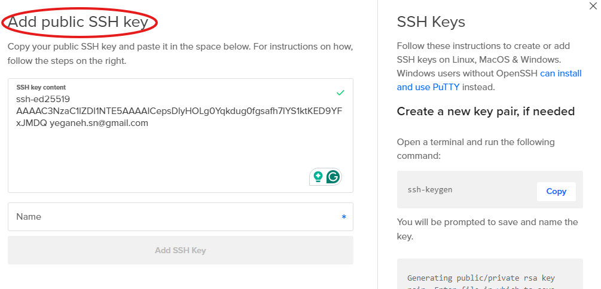
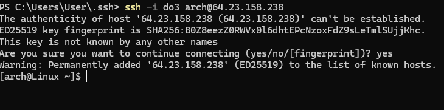

# Effortless Arch Linux Droplet Setup on DigitalOcean with SSH and Cloud-Init

**Project Overview**
--------------------------------------------------

In this project, you'll set up a custom Arch Linux Droplet on DigitalOcean. You'll generate SSH keys for secure access, create a custom Arch Linux image, and deploy it on a DigitalOcean Droplet. Lastly, you'll automate the setup using a cloud-init configuration file. By the end, you'll have a personalized Arch Linux Droplet ready for use.

----------------------------------------------------
## Step 1: Create SSH Keys on Your Local Machine (For Windows)
***What are SSH Keys?***

SSH keys are a pair of cryptographic keys used to securely connect your local machine to a remote server. They consist of:
Public Key: This key can be shared with anyone and is placed on the server you want to connect to.
Private Key: This key is kept secure on your local machine and should never be shared.
Why Should You Use SSH Keys?

Security: They provide a more secure method of authentication compared to passwords.
Convenience: Once set up, you can log in without entering a password each time.
Automation: They are essential for automating tasks like deploying code or running scripts on remote servers.

***How to Generate SSH Keys:***

**1.Open Command Prompt or PowerShell**

Type the command

    ssh-keygen -t ed25519 -f C:\Users\your-user-name\.ssh\do-key -C "youremail@email.com"

![screenshot]

This command starts the process of generating a new SSH key pair.

-t = type (this is the type of encryption used for the key)

-f = filename (specify filename and location)

-C = comment (attaches a comment to a key)

**2.Enter the File in Which to Save the Key:**

You will be prompted with:

Enter file in which to save the key (/home/yourusername/.ssh/id_rsa):

Press Enter to accept the default location and file name, or specify the path where you want to save the key.

**3.Enter Passphrase:**

You will be prompted with:

Enter passphrase (empty for no passphrase):

Type a passphrase for an extra layer of security, or press Enter to leave it empty for no passphrase.

**4.Confirm the Passphrase:**

You will be prompted again with:

Enter same passphrase again:

***Key Details:***

**Fingerprint:** 
SHA256:W3+KdMXc7aPoPLRvwB5IP+Xq4Jt/Hh9aja4Kjn1H5U8 yourusername@hostname

**Private Key Location:** /home/yourusername/.ssh/id_rsa

**Public Key Location:** /home/yourusername/.ssh/id_rsa.pub

Congratulations! Your new SSH key pair has been successfully created and saved!

You will see an image similar to:

![screenshot]

---

## Step 2: Add a Custom Arch Linux Image Using the Web Console

**1.Install archiso:**

Run the following command:

    sudo pacman -S archiso

archiso is a tool for building Arch Linux live CD/USB ISO images, which is essential for creating a custom image.

**2.Prepare a Custom Profile:**

Copy the default releng profile to a directory where you can customize it:

    cp -r /usr/share/archiso/configs/releng/ ~/custom-archiso

![screenshot]

**3.Customize the Profile:**

Edit the packages.x86_64 file to include the packages you want to install.

**4.Add Custom Files to the airootfs Directory:**

Copy any custom scripts or files you want to include in your image

    cp ~/myscript.sh ~/custom-archiso/airootfs/root/

**5.Build the ISO:**

Navigate to your custom profile directory:
 cd ~/custom-archiso

![screenshot]

Build the ISO using the following command:

    sudo mkarchiso -v .

![screenshot]

**6.Upload the ISO to Your Cloud Provider:**

Once the ISO is built, you need to upload it to DigitalOcean or another cloud provider to use it for creating virtual machines.

----------------------------------------------------

## Step 3: Create a Droplet Running Arch Linux Using the DigitalOcean Web Console

**1.Create a DigitalOcean Account:**
Visit DigitalOcean and create an account: https://www.digitalocean.com/

**2.Log In to DigitalOcean:**

After logging in, navigate to the Droplets section.

**3.Select a Region:**

Choose the region closest to you for the Droplet location.

![screenshot]

**4.Create a Droplet:**

![screenshot]

Click Create Droplet.

**5.Choose Custom Images:**

Select your uploaded Arch Linux image to continue.

Select Custom Images and pick the Arch Linux image you previously uploaded.

**6.Configure the Droplet:**

Select the Droplet specifications like CPU, RAM, and storage.

**7.Add Your SSH Key:**

Click New SSH Key and paste your public key.

![screenshot]

**8.Finalize and Create the Droplet:**

Complete the setup and create the Droplet.

**9.Connect the droplet 

connect your droplet to the ssh key.

    ssh -i .ssh/do-key arch@64.23.158.238

![screenshot]

-------------------------------------------------------

## Step 4: Use a Cloud-Init Configuration File to Automate Initial Setup Tasks

***What is Cloud-Init?***

Cloud-init is a tool used to automate the initial setup of cloud instances. It allows you to define configuration files that can set up users, install packages, and perform other setup tasks automatically when the instance boots for the first time.
Cloud-Init Configuration File:

**1.Create a Cloud-Init Configuration File:**

Begin by creating a file named cloud-init.yaml on your local machine. This file will contain the configurations necessary for your droplet. You can use your preferred text editor, such as nano or vim, to create and edit this file.

    nano cloud-init.yaml

**Example of a cloud-init.yaml file:**

**users**:

- name: 
    - customuser
    sudo: 
    - ['ALL=(ALL) NOPASSWD:ALL']

- groups:
     - admin
     - sudo

- shell: 
    - /bin/zsh

    ssh-authorized-keys:
    - ssh-rsa AAAAB3...your_public_key

**packages:**
  - neofetch
  - vim
  - curl
  - git

ssh_pwauth: false

**Note!** SSH password authentication is disabled (ssh_pwauth: false), which enhances security by only allowing SSH key authentication.

**2.Upload the Cloud-Init File:**

When creating the Droplet, paste the contents of your cloud-init.yaml file in the User Data section.

**3.Deploy the Droplet:**

When the Droplet is created, the cloud-init script will run on the first boot, setting up your user and other configurations automatically.

-------------------------------------------

By following these steps, you will have a fully functional Arch Linux Droplet, customized and automated using cloud-init.